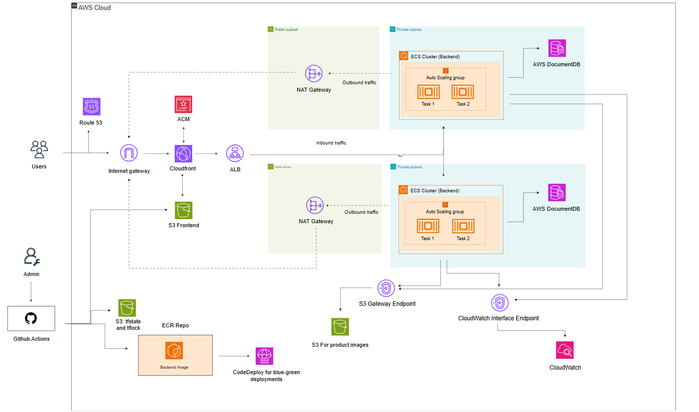

# Multi-environment infra project for deploying MERN stack e-commerce app

## What is this project?

This project demonstrates a production-ready Multi-AZ infrastructure setup for a MERN e-commerce app using Terraform and AWS. It supports multi-environment setup (dev/prod), blue-green deployments, and GitHub Actions CI/CD with OIDC authentication



## Tech stack

- React
- Node.js
- MongoDB
- Express.js
- Terraform
- Docker
- AWS
- GitHub Actions

## Features

### Frontend

- Written in React.js with Redux for state management.

### Backend

- Written in Node.js with Express.js framework.

### Payment Integration:

- Paypal: App allows to pay via paypal or credit card

### Modules folder

- Contains terraform modules for reusable infrastructure components.
- Each module is designed to handle specific resources like VPC, S3, ECS etc.
- Modules can be easily integrated into different environments.
- Promotes code reusability and maintainability.

### Environments folder

- Contains separate folders for each environment (dev, prod).
- Each environment folder uses the modules to create the required infrastructure.
- For storing current state of infrastructure, terraform remote state is used with S3 backend which also provides state locking functionality
- Supports scalability by allowing easy addition of new resources or modification of existing ones.
- Enhances collaboration among team members by providing a clear structure for environment management.

### OIDC folder

- Contains configurations for setting up OpenID Connect (OIDC) authentication.
- Enables secure access to AWS resources using GitHub Actions.
- Facilitates automated deployments by integrating with CI/CD pipelines.
- Improves security by eliminating the need for long-lived AWS credentials.

### .github/workflows folder

- Contains GitHub Actions workflows for automating infrastructure deployment.
- Workflows are triggered on push events to specific branches (e.g., main for production, dev for development).
- Automates the process of deploying new versions of the application with zero downtime using blue-green deployment strategy.
- Ensures consistent and repeatable deployments across different environments.

## Setup Instructions

### Environment variables (for local environment)

.env and add the following

- ENV = DEV
- PORT = 8080
- MONGO_URI = your mongodb uri
- JWT_SECRET = 'abcd1234'
- PAYPAL_CLIENT_ID = your paypal client id
- PAGINATION_LIMIT = 8

#### Paypal Setup

- Go to https://developer.paypal.com/dashboard/applications/sandbox
- Create a new app (add name, select type merchant and your business sandbox account)
- After creating the app you will see your sandbox client id which you can copy and use in your envs

#### Install Dependencies (frontend)

cd frontend <br>
npm install <br>
npm run start

#### Install Dependencies (backend)

cd backend <br>
npm install <br>
npm run server

### Environment variables (for aws)

#### AWS Secrets Manager is used to store sensitive information like database credentials, API keys, etc. Ensure that the necessary secrets are created in AWS Secrets Manager for both dev and prod aws environments.

#### Dev Environment Secrets

For this project i created has 5 separate secrets <br>
Every secret type is "Other type of secret" in AWS Secrets Manager

**NOTE**: ENV variable is used to differentiate between mongodb for local development and DocumentDB for aws development. Thats why its set to PROD in both aws envs.

Dev secrets

- dev/docdb/master_password - contains the master password for the DocumentDB cluster. (enter plain text)
- dev/proshop/app_secrets - contains these values (key value pair format)
  - PORT = 8080
  - JWT = abcd1234
  - PAGINATION_LIMIT = 8
  - PAYPAL_CLIENT_ID = your paypal client id
  - ENV = PROD

Prod secrets

- prod/docdb/master_password - contains the master password for the DocumentDB cluster. (enter plain text)
- prod/proshop/app_secrets - contains these values (key value pair format)
  - PORT = 8080
  - JWT = abcd1234
  - PAGINATION_LIMIT = 8
  - PAYPAL_CLIENT_ID = your paypal client id
  - ENV = PROD

Used for both envs though can be split into two if needed (used for creating admin user in the app)

- prod/credentials/proshop (key value pair format)
  - email = admin@email.com
  - password = admin123

### Creating S3 bucket

Creating s3 bucket manually is necessary for terraform state management and state locking. You can choose default options with enabled versioning

Requirements:

1. Make sure this bucket exists before running `terraform init` in any environment and in both environments (dev, prod) add your bucket name you just created.

```hcl
 backend "s3" {
    bucket         = "my-blue-green-depl-tf-state" # <---- Use your bucket name
    key            = "tf-state-dev"
    region         = "eu-central-1"
    use_lockfile = true
    encrypt = true
  }
```

2. Purchase a domain from route 53 or use an existing one. Add your domain name in both environments (dev, prod) in locals.

**NOTE**: for cost savings buy domain ending with .click

```hcl
locals {
    dev_azs = slice(data.aws_availability_zones.available.names, 0, 2)
    domain_name = "dev.my-database-vector-ai.click" # <---- DEFINE YOUR DOMAIN HERE
    environment = "dev"
    parent_domain_name  = "my-database-vector-ai.click" # <---- DEFINE YOUR DOMAIN HERE
    prefix = "dev"
    image_bucket_name = "${local.prefix}-proshop-images"
}
```

For first dev infra launch go to

```hcl
cd environments/dev
terraform init
terraform apply
```

For first prod infra launch go to

```hcl
cd environments/prod
terraform init
terraform apply
```

For OIDC setup required for github actions to authenticate with aws

```hcl
cd oidc
terraform init
terraform apply
```

### GitHub Actions CI/CD Setup

For this repo:

- Create a new develop branch
- Set develop branch as default branch
- Protect main branch, and develop branch (require pull request reviews before merging, require status checks to pass before merging - select both workflows)

Here is the list of necessary env variables to add in your github repo secrets

- AWS_REGION - your aws region
- AWS_ROLE_TO_ASSUME - your role arn for github actions to assume (the arn of OIDC role)
- CLOUDFRONT_DISTRIBUTION_ID - cloudfront distribution id for prod (shown in outputs after terraform apply)
- CODEDEPLOY_APP_NAME - codedeploy app name for prod
- CODEDEPLOY_DEPLOYMENT_GROUP_NAME - codedeploy deployment group name for prod
- DEV_AWS_ROLE_TO_ASSUME - your role arn for github actions to assume (the arn of OIDC role) for dev env
- DEV_CLOUDFRONT_DISTRIBUTION_ID - cloudfront distribution id for dev (shown in outputs after terraform apply)
- DEV_ECR_REPOSITORY - ecr repo name for dev
- DEV_ECS_CLUSTER_NAME - ecs cluster name for dev
- DEV_ECS_SERVICE_NAME - ecs service name for dev
- DEV_S3_BUCKET_NAME - s3 bucket name for dev (frontend url)
- ECR_REPOSITORY - ecr repo name for prod
- ECS_CLUSTER_NAME - ecs cluster name for prod
- ECS_SERVICE_NAME - ecs service name for prod
- ECS_TASK_FAMILY - ecs task family for prod
- S3_BUCKET_NAME - s3 bucket name for prod (frontend url)
- TF_STATE_BUCKET - your s3 bucket name for terraform state management

## Cleanup [IMPORTANT]

To destroy all associated infrastructure for an environment:

```hcl
cd environments/dev or prod
terraform destroy
```

License and Acknowledgments
The fundamental application code (MERN stack frontend and backend) used in this infrastructure demonstration is based on the Proshop-v2 project originally developed by Brad Traversy of Traversy Media. The complete infrastructure setup, Terraform modules, CI/CD configuration, and environment management demonstrated in this repository are independently developed and built on this project.

#### Minor issues

- Product data seeding in the production environment may occasionally process duplicate entries. This behavior is related to the backend layer and was intentionally scoped out, prioritizing the development of the multi-environment infrastructure and CI/CD automation demonstrated here.

#### 💰 Estimated AWS Costs

**Development Environment:** ~$80-100/month
**Production Environment:** ~$140-240/month

_Costs vary based on traffic and usage. Use AWS Cost Calculator for precise estimates._

### License for Application Code (Frontend & Backend)

The application code is provided under the following license:

The MIT License

Copyright (c) 2023 Traversy Media https://traversymedia.com

Permission is hereby granted, free of charge, to any person obtaining a copy of this software and associated documentation files (the "Software"), to deal in the Software without restriction, including without limitation the rights to use, copy, modify, merge, publish, distribute, sublicense, and/or sell copies of the Software, and to permit persons to whom the Software is furnished to do so, subject to the following conditions:

The above copyright notice and this permission notice shall be included in all copies or substantial portions of the Software.

THE SOFTWARE IS PROVIDED "AS IS", WITHOUT WARRANTY OF ANY KIND, EXPRESS OR IMPLIED, INCLUDING BUT NOT LIMITED TO THE WARRANTIES OF MERCHANTABILITY, FITNESS FOR A PARTICULAR PURPOSE AND NONINFRINGEMENT. IN NO EVENT SHALL THE AUTHORS OR COPYRIGHT HOLDERS BE LIABLE FOR ANY CLAIM, DAMAGES OR OTHER LIABILITY, WHETHER IN AN ACTION OF CONTRACT, TORT OR OTHERWISE, ARISING FROM, OUT OF OR IN CONNECTION WITH THE SOFTWARE OR THE USE OR OTHER DEALINGS IN THE SOFTWARE.
